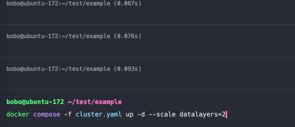

# DataLayers with Grafana
Visualize the data stored in DataLayers using Grafana.

## How to use

1. Clone the code repository. Please make sure you have installed the `git`, and then running the following commands to start the demo:

  ```bash
  git clone https://github.com/datalayers-io/datalayers-with-grafana.git
  ```
  
2. Please run the following script first.
  ```bash
  cd datalayers-with-grafana
  
  # Make sure it have execute permissions
  ./init.sh  
  ```

3. Please make sure you have installed the [docker](https://www.docker.com/), and then running the following commands to start the demo:

``` bash
# Starts with standalone-mode
docker compose -f standalone.yaml up -d

# Starts with cluster-mode
docker compose -f cluster.yaml up -d --scale datalayers=2
```



4. Running the following commands to see the message from DataLayers:

```bash
docker compose -f {your_started_yaml_file} logs datalayers
```

> If your're using standalone-mode, {your_started_yaml_file} means `standalone.yaml`, otherwise means `cluster.yaml`

5. Connect to DataLayers using the command-line tool:

```bash
docker compose exec -f {your_started_yaml_file} -it datalayers dlsql -u admin -p public
```

6. Create a database using the command-line tool:

```bash
docker compose exec -f {your_started_yaml_file} -it datalayers dlsql -u admin -p public
dlsql> create database demo;
```


7. Create tables:

``` bash
todo
```

6. Use the following script to write data:

``` bash
todo
```

7. Query data through the command line:

``` bash
todo
```

8. Visualize data using Grafana:

todo

Visit: [http://localhost:30300/](http://localhost:30300/)

> Username: admin <br> Password: admin


## License

[Apache License 2.0](./LICENSE)
