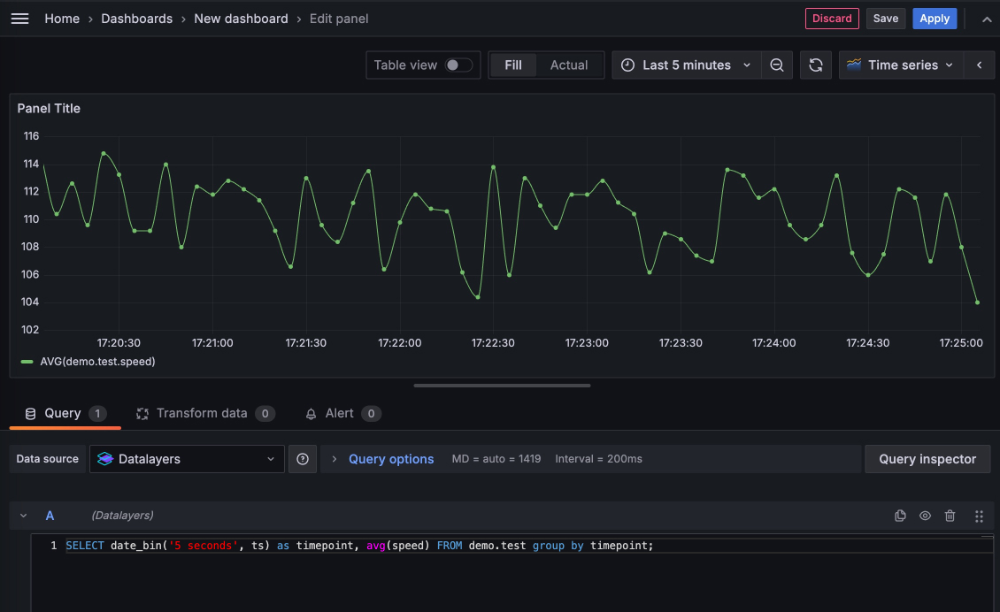

# DataLayers with Grafana
Visualize the data stored in DataLayers using Grafana.

## How to use

1. Clone the code repository. Please make sure you have installed the `git`, and then running the following commands to start the demo:

  ```bash
  git clone https://github.com/datalayers-io/datalayers-with-grafana.git
  ```
  
2. Please run the following script first.
  ```bash
  cd datalayers-with-grafana
  
  # Make sure it have execute permissions
  ./init.sh  
  ```

3. Please make sure you have installed the [docker](https://www.docker.com/), and then running the following commands to start the demo:

``` bash
docker compose -f standalone.yaml up -d
```

4. Running the following commands to see the message from DataLayers: (If you don't care about logs, skip it.)

``` bash
docker compose -f standalone.yaml logs datalayers
```

5. Connect to DataLayers using the command-line tool:

```bash
docker compose -f standalone.yaml exec -it datalayers dlsql -u admin -p public
```

6. Create a database using the command-line tool:

```bash
docker compose -f standalone.yaml exec -it datalayers dlsql -u admin -p public
dlsql> create database demo;
```


7. Create tables:

``` bash
CREATE TABLE test(
  ts TIMESTAMP(3) NOT NULL DEFAULT CURRENT_TIMESTAMP,
  sn int NOT NULL,
  speed float NOT NULL,
  temperature float,
  timestamp KEY (ts))
PARTITION BY HASH(sn) PARTITIONS 2
ENGINE=TimeSeries;
```

6. Use the following script to write data:

``` bash
while true
do
  speed=$((RANDOM % 21 + 100))
  temperature=$((RANDOM % 11 + 10))
  timestamp=$(date +%s%9N) # ns
  code="insert into demo.test(sn,speed,temperature) values(10000, ${temperature}, ${speed})"
  echo "$code"
  curl -u"admin:public" -X POST http://127.0.0.1:18361/api/v1/sql?db=demo -H 'Content-Type: application/binary' -d "$code" -s -o /dev/null
  sleep 1
done
```

7. Query data through the command line:

``` bash
docker compose -f standalone.yaml exec -it datalayers dlsql -u admin -p public

dlsql> select * from demo.test limit 10
```

8. Visualize data using Grafana:

Try to add dashboard by `Menu - Dashboards` page.



For example:

``` sql
SELECT date_bin('5 seconds', ts) as timepoint, avg(speed) FROM demo.test group by timepoint;

```
As always, you can use [SQL functions](https://docs.datalayers.cn/datalayers/latest/sql-reference/sql-functions.html) in the sentence.


Visit: [http://localhost:10300/](http://localhost:10300/)

> Username: admin <br> Password: admin


## End the experience

You can use below command to exit processes.

``` bash
docker compose -f standalone.yaml down
```


## License

[Apache License 2.0](./LICENSE)
