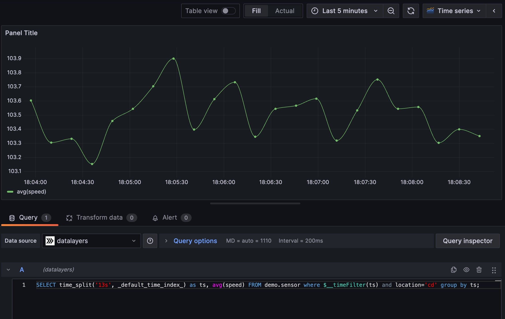

# DataLayers with Grafana
Visualize the data stored in DataLayers using Grafana.

## How to use

1. Clone the code repository. 

  ```bash
  $ git clone https://github.com/datalayers-io/datalayers-with-grafana.git
  ```
  
2. Please run the following script first.

```bash
$ cd datalayers-with-grafana && ./init.sh  
```

3. Please make sure you have installed [docker](https://www.docker.com/), and then run the following commands to start the demo:

``` bash
$ docker pull datalayers/datalayers:nightly
```

``` bash
$ docker compose -f cluster.yaml up -d
```

4. Perform database operations using command line tools:
```bash
$ docker compose -f cluster.yaml exec -it datalayers dlsql -u admin -p public
> create database demo;
```

5. Create tables:

``` bash
> use demo;
> CREATE TABLE test(
    ts TIMESTAMP(3) NOT NULL DEFAULT CURRENT_TIMESTAMP,
    sn int NOT NULL,
    speed float NOT NULL,
    temperature float,
    timestamp KEY (ts))
  PARTITION BY HASH(sn) PARTITIONS 2
  ENGINE=TimeSeries;
```
Use `exit` to quit the command line tool.

6. Use the following script to write data:

``` bash
while true
do
  speed=$((RANDOM % 21 + 100))
  temperature=$((RANDOM % 11 + 10))
  timestamp=$(date +%s%9N) # ns
  code="insert into demo.test(sn,speed,temperature) values(10000, ${temperature}, ${speed})"
  echo "$code"
  curl -u"admin:public" -X POST http://127.0.0.1:18361/api/v1/sql?db=demo -H 'Content-Type: application/binary' -d "$code" -s -o /dev/null
  sleep 1
done
```

7. Query data using command line tools:

``` bash
$ docker compose -f cluster.yaml exec -it datalayers dlsql -u admin -p public
> select * from demo.test limit 10
```

8. Use Grafana for data visualization:

Visit: [http://localhost:13000/](http://localhost:13000/)

> Username: admin <br> Password: admin


Try to add dashboard by `Menu - Dashboards` page.



For example:

``` SQL
> SELECT date_bin('5 seconds', ts) as timepoint, avg(speed) FROM demo.test group by timepoint;
```
As always, you can use [SQL functions](https://docs.datalayers.cn/datalayers/latest/sql-reference/sql-functions.html) in the sentence.

## Standalone-mode

Click to [Standalone-mode](./README.md) documentation.

## License
[Apache License 2.0](./LICENSE)
